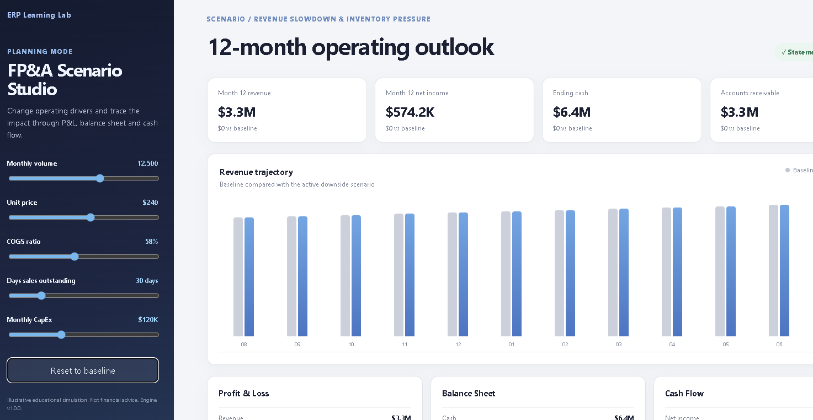
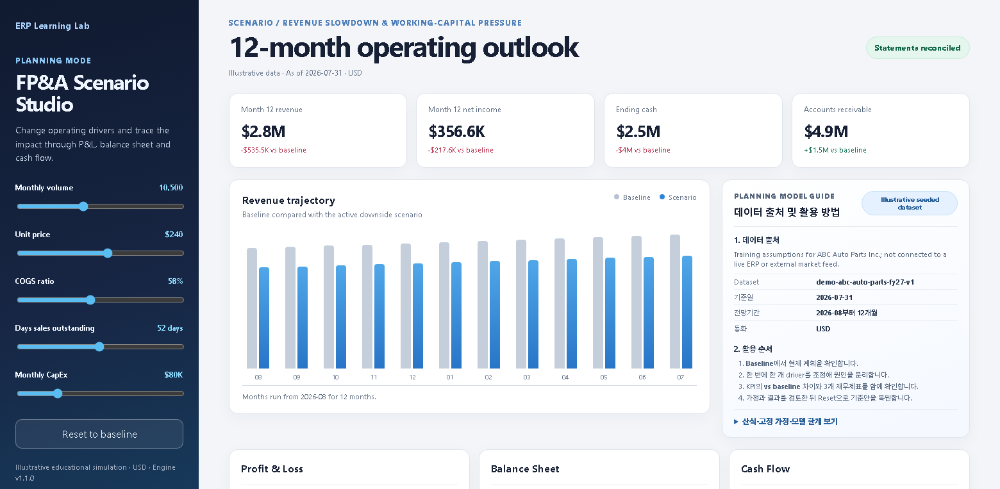
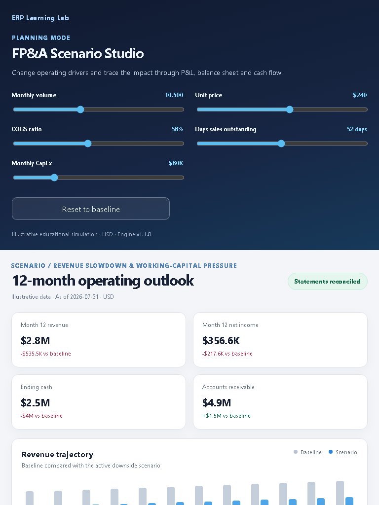

# FP&A Scenario Studio layout audit

## Audit scope

- Surface: `/planning`
- User goal: adjust operating drivers, understand the 12-month impact, and know where the Planning Mode data comes from.
- Viewports reviewed: 1560×763 desktop and 768×1024 tablet.

## Evidence

### Before — user-provided production screenshot

### After — desktop

### After — tablet

## Flow health

1. **Enter Planning Mode — Healthy.** The Planning Lab remains visually distinct from the ERP process simulator and retains a direct return link.
2. **Adjust operating drivers — Healthy.** Controls have associated labels, visible values, keyboard focus treatment, and a two-column tablet reflow.
3. **Read scenario outcomes — Healthy.** KPI cards wrap before they overflow, the reconciliation state is no longer clipped, and the chart scales inside the available width.
4. **Understand data and methodology — Healthy.** The guide identifies the seeded dataset, period, currency, formulas, fixed assumptions, limitations, and a recommended analysis sequence.
5. **Review linked statements — Healthy.** The three statement cards retain their hierarchy and begin within the desktop viewport after the chart and guide were compacted.

## Findings addressed

- Removed horizontal clipping caused by a rigid four-card desktop layout.
- Reduced chart and guide height so linked statements remain discoverable.
- Replaced the broken status glyph with plain status text.
- Made the illustrative data source explicit rather than relying on a footer disclaimer.
- Added responsive breakpoints for desktop, tablet, and mobile widths.
- Added accessible labels, focus styles, chart context, and semantic section headings.

## Evidence limits

The screenshots confirm visual reflow and visible content. Automated tests cover the model profile and balance integrity, but this review does not claim full WCAG conformance or screen-reader certification.
